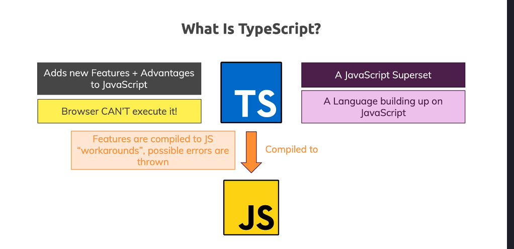
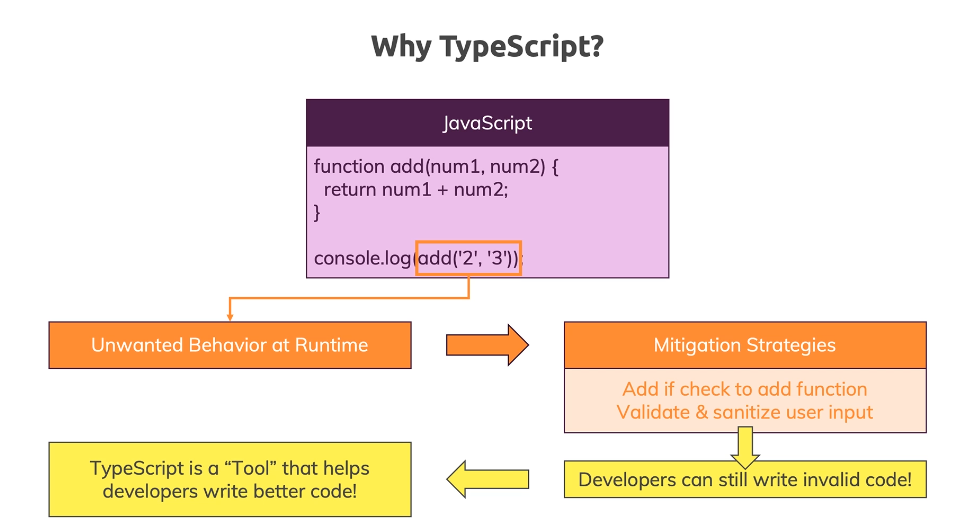
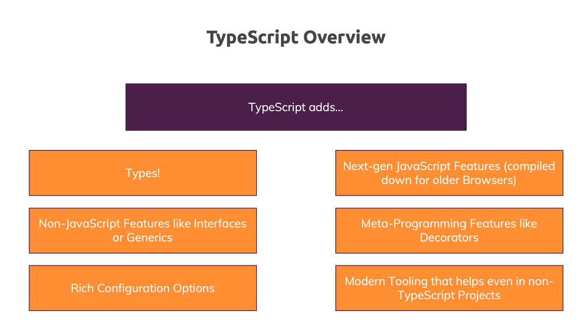
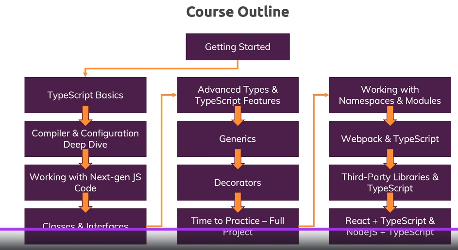

1. What is TypeScript?

   A JavaScript Superset. A Language building up on JavaScript. Adds new Features + Advantages to JavaScript. Browser/Node.js **CAN'T** execute TypeScript. TypeScript ---Compiled to---> JS.
   

2. Why TypeScript?

   Find error earlier and not in the runtime. Personally I think this is because people are used to C# or C++ behavior.
   

   ```JS
   function add(num1, num2){
     return num1 + num2;
   }
   console.log(add('2','3'));
   ```

3. TypeScript Overview
   
4. course outline
   
5. Core Tyeps
   
6. They key difference is : JavaScript uses "dynamic types" (resolved at runtime). TypeScript uses 'static tyeps" (set during development).
7. In TypeScript, the core primitive tyeps are all lowercase.
